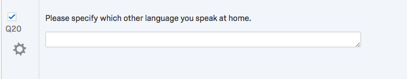
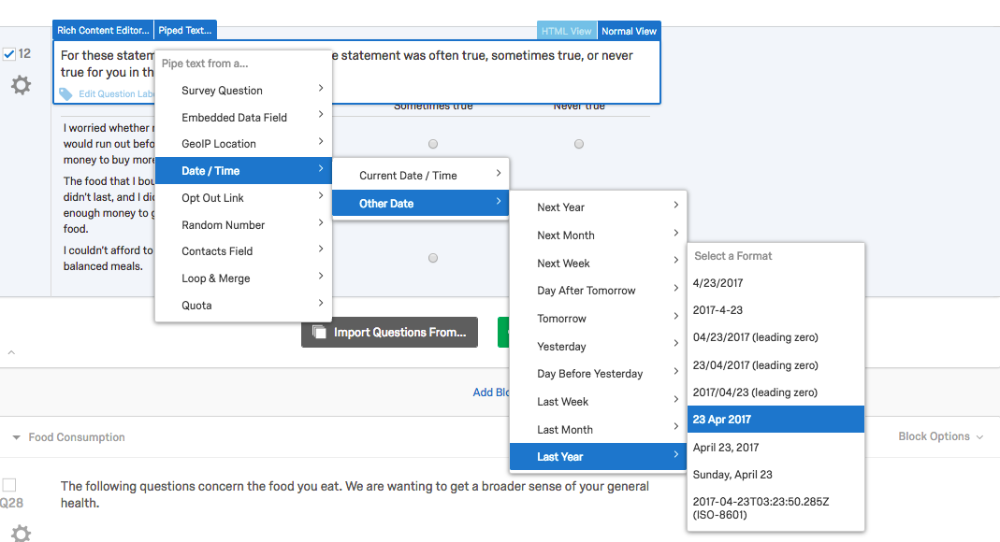
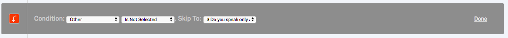

>Objectives
>- Objective 1
>- Objective 2
>- Objective 3
{: .objective}

Now we have our survey in Qualtrics, let's make customise it to suit our needs.

## Configuring questions and adding answers
With using Qualtrics import functionality to build our survey, we are somewhat limited with the options to change question types.

> Because the four main question types are text entry, multiple choice, matrix and then the specialty types, we can only move around in these categories when changing a type. A key way to find out what types you can choose from for each category is to click on the question in Qualtrics and inspect your options in the righthand menu.
> { .note}

[ADD SCREENSHOT]

### Steps
1. Because the answer options for `QID6` are kind of on a logical scale, let's set it to `Position > Horizontal`. After this, let's do the same for `QID8`, `QID12` and `QID19`.

For `QID4`, note that we have an `Other` option. Say we want to know what this **other** is. Well let's add in another question to have the respondent specify which other language they speak at home.

2. To do this, go to the question after `QID4` (i.e., `QID3`) and click on the top  green +  icon.

3. In the new question, type _Please specify which other languages you speak at home_. The set this question to `Text Entry` question type.

4. Now let's go and re-number our questions. Note that they are currently all mixed up. This can be done by hovering your cursor over the `QID` number and double clicking. In total you should now have 19 questions.

## Skip logic
With the relationship between Qn `3` and Qn `4`, we can use what Qualtrics calls [**skip logic**](https://www.qualtrics.com/support/survey-platform/survey-module/question-options/skip-logic/). Skip logic allows us to insert conditional pathways in our survey. For example, we don't want to ask Qn `4` to respondents who have *not* answered `Other` to Qn `3`. So in this case, let's add a skip to Qn `3`.

### Steps
1. Go to the  icon and `Add Skip Logic...`
2. Enter in the condition: `Other`, `Is selected` Skip to: `3 Do you speak only a non-English language, more of a non-English language than English, both equally, more English than a non-English language, or only English?`
3. The click **Done**

## Adding Blocks
We see that the Qualtrics has inserted two blocks for us, called `Languages` and `Health` when we imported out survey. If you read through the questions, you'll note there are other logical places that blocks could be inserted.

### Steps
1. From Qn `8` to Qn `10`, the questions refer to food consumptions. Let's insert a block called `Food Consumption`and place these questions in it. Check Qns `8`, `9`, `10` and `11` (lefthand side, check box) and on the righthand side click `Move to New Block` (Take note of the other options we have here too; *delete*, *copy*, *group*, *move*...).
2. Rename new block, *"Food Consumption"*.
3. Let's do the same for Qns `12` and `13` and call this block, *"Mental Wellbeing"*.
4. ... and the same for `15`, `16`, `17`, `18` and `19` and call this block, *"Physical Exercise"*.
5. Then for Qn `12`, click `Add Block` below the first block, call this *"Financial Standing"*. Move Qn `14` into this block by hovering over the question and clicking the down arrow.

We should end up with **seven** blocks, which **must** flow as follows (please double check this otherwise it will pose some downstream issues):
1. Demographics
2. Languages
3. Health
4. Food Consumption
5. Mental Wellbeing
6. Physical Exercise
7. Financial Standing

>The benefit of blocks is to organise our survey into parts. For the most part, the benefit will be felt by you, the survey designer, which you observe when you get into **Survey Flow**. { .note}

## Add Descriptive text
To improve the user experience of the survey, let's add a chunk of text at the beginning of each block, explaining what the block's questions will involve.

### Steps
To insert a Descriptive block at the top of each block:
1. Go to the `Language` block's first question, hover your cursor over the question and click on top green plus sign.
2. This will insert an empty question above. Change the Question Type from `Multiple Choice` to `Descriptive Text`.
3. Now we have an empty box to insert our descriptive text. Enter a descriptive text for `Languages`.
4. Repeat these steps for:
  * Health
  * Food Consumption
  * Mental Wellbeing
  * Physical Exercise
  * Financial Standing

## Response validation
Now we need to control what data our respondents will enter. The multiple choice questions are typically alright from a data integrity point of view because they usually only have set options to choose from. However, `Text Entry` questions (which are "free text" entry) can be problematic because they allow any keyboard characters to be entered.

We can, however, force validations on our `Text Entry` questions:
* Qn `15`
* Qn `18`

### Steps
1. Click on Qn `15`
2. Change the Text Type to `Single Line`
3. Select `Content Validation` under **Validation Type**
4. Select `Number` under **Content Type**
5. Repeat for Qn `18`
6. Report for Qn `4` but select `Text Only (Non-numeric)`

## Add Piped text
Another excellent feature of Qualtrics is the ability to "pipe" text into its text-based elements. Piping is a computer science concept where you can pass an output of one command to another command.
Note in Qn `14` we have a funny bit of text, `{DISPLAY CURRENT MONTH AND LAST YEAR}`. This is a placeholder for our question to display the current month and year. With the Qualtrics `Piped text` feature, we can have the computer display this for us dynamically when the survey is undertaken.

### Steps
1. Click on the question text
2. Select `{DISPLAY CURRENT MONTH AND LAST YEAR}` and delete
3. Click on `Piped Text...` on the top left corner
4. You'll get a dropdown. Click on `Date / Time`>`Other Date`>`Last Year`>...and pick any format you wish

This will insert some fancy text that looks something like this: `${date://OtherDate/PT/-1%20year}`

[Here's more](https://www.qualtrics.com/support/survey-platform/survey-module/editing-questions/piped-text/piped-text-overview/) on **Piped Text** and how it can be used.

In more advanced survey design we get into piping survey responses to forthcoming questions based on conditional rules. (E.g., if Respondent answers 'x' to a particular question, use 'x' in this question).

## Use Skip Logic
Another advanced feature of Qualtrics is "skip logic". Skip Logic allows you to tailor the survey to be more relevant to your respondents answers. For example, for Qn `3` we allow the respondent to select `Other` from the survey and then follow this question with a place for them to specify the other language (Qn `4`). However, Qn `4` is not relevant to respondents who don't select `Other` for Qn `3`, so it would be great not to show these respondents this question. This is a perfect case to use Skip Logic.

### Steps
1. Click on the  button for Qn `3`
2. Click on `Add Skip Logic...`
3. Click on the hyperlinked text in the Skip Logic box to configure the variables for our Skip condition.
4. Ensure the following is selected:

>### Skip or Display?
>There are a few ways to achieve this outcome. Another way is to use "Display Logic", which does the same thing as Skip Logic but differently. Its works from the question to be displayed under certain conditions rather than the question from which the conditions were met. If you have a simple condition, then Skip Logic is best. Alternatively if your condition is very specific or you have many conditions, you should use "Display Logic". More on Skip and Display logic [here](https://www.qualtrics.com/support/survey-platform/survey-module/question-options/skip-logic/) and [here](https://www.qualtrics.com/support/survey-platform/survey-module/question-options/display-logic/).{ .note}

## Change look and feel
The final of our basic steps is to make our survey look good. We can do this by using the `Look & Feel` feature at the top left corner. Your university might have its own Theme template to use which you should enquire about. Otherwise, Qualtrics has a number of survey templates to choose from.

### Steps
1. Click `Change Theme` and select something that you like. Trial a few if you wish
2. Then you can customise your font. Click `Fonts` and select a font style you like. If you wish, you can style your question text differently to your choice text, too. Experiment!
3. Under `Colors`, you have some flexibility to tailor the survey colours for different types of text, headers and footers, alternate rows, etc.
4. Finally under `Advanced` you can enter a header and a footer. Try this by putting the name of the survey, "Health and Nutrition survey", and your university name in the header.  To get more advanced formatting (e.g., to insert an image or logo) then click on `edit` under `Header` or `Footer`.

Ok, now we should have a survey that is looking good and working as we intend. The best way to test this is to click  and go through all the questions, checking for performance issues or typos.

## Next
In the next module we're going to look at how to distribute the survey.

>[Go to Module 6]({{ site.baseurl }}/modules/6a-distribution-methods){: .next-link}
