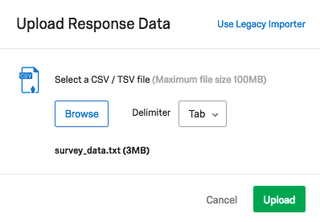

>Objectives
>- Objective 1
>- Objective 2
>- Objective 3
{: .objective}

For our purposes in this course, we have formatted 9,000+ responses to match our survey, which we will upload and analyse. Thankfully, the Qualtrics interface allows us to **import** survey responses as long as they are formatted in the correct way. Of course, you would usually collect responses by distributing the survey via the methods we covered in [Module 6a]({{ site.baseurl }}/modules/6a-distribution-methods).

## Upload survey data
>The responses we will be importing today are a mixture of fictional and actual responses to the 2013-2014 National Health and Nutrition Examination Survey, which we introduced in [Module 4]({{ site.baseurl }}/modules/4-health-study). Most of the NHANES survey data is freely available from the Centre for Disease Control and Prevention website. For instance, our 2013-14 data is all available [here](https://wwwn.cdc.gov/nchs/nhanes/search/datapage.aspx?Component=Examination&CycleBeginYear=2013), downloadable in a `.xpt` format (a format from SAS, Statistical Analysis Software), which then needs to be converted into Comma Separated Value format. Thankfully, [a group of people on Kaggle.com](https://www.kaggle.com/cdc/national-health-and-nutrition-examination-survey/version/1#) has already done this for us. The version we are using today has been abbreviated to match the shortened survey we have built in Qualtrics, with a couple of extra fields added. { .note}

### Matching the export template with the import data
There is some extra coding that Qualtrics needs to import data. So it is recommended that if you want to import data into Qualtrics that you first export the survey's data (even if you haven't collected any responses yet) and then copy and paste the data you want to import into this template. Here's how to do this...

1. Go to `Data & Analysis` (on the top menu bar). This is the section that we do all of the analysis using Qualtrics' analysis tools.
2. You should automatically be located in the `Data` tab. Here you will see a dropdown called `Export & Import`; click on this, and select `Export Data...`.

This will give us a Qualtrics-ready template of the our survey to copy and paste our data into and then upload.

3. Select `TSV` (short for **tab separated values**; the import/export recommended option) and ensure `Download all fields` and `Use choice text` are checked.

This will produce our survey in a zipped package.

4. Unzip the download and open the extracted `.tsv` file in Excel.

> From column A to Q, these fields are holding the survey response metadata that Qualtrics collects for each responses. Our survey questions begin at column R. { .note}

5. Using Excel, open the `survey_data.csv` file in your `Qualtrics course pack` you downloaded at the beginning of the class.
6. Select all of the data from `survey_data.csv` (not including the heading). (Tip: selecting cell `A3` and press `Ctrl` and the down arrow key and then the right arrow key will select all of the data. You should end up with `A3:Z9858` selected).
7. Copy this selection and then paste into the Qualtrics data template we just exported, starting at `R4`.
8. Save this file in your project directory and keep the filename.
9. Now go back to the `Data` tab under `Data & Analysis` and click on `Export & Import` again.
10. This time, click on `Import Data...` and `Browse`
11. Select the file from your project directory and Ok.
12. As once mentioned previously, this is a Tab Separated file (which is the recommended format by Qualtrics for importing data), so next to **Delimiter** select `Tab`.

### Pairing the `.txt` file with the survey questions
We should now get another dialogue box that allows us to map the data fields from the `.txt` file with our questions in Qualtrics. If the file is correctly formatted then, these pairings should be automatically assigned. For example, **Field 1 - What language(s) do you usually speak...** (from the survey) should be paired with **Header 1** (taken from the `.txt` file) and so forth.

> A quick note on how this is happening: if we look at our survey_data.txt file using Excel, you will see that on the third row, there's some funny looking metadata. E.g., 3A has `{"ImportId":"QID2"}`. This is the trigger for Qualtrics to assume our pairings between the data fields and the survey questions. It is quite useful feature that saves us time on doing each ourselves. A quick way to generate these codes is to export your survey as a Tab Separated document, then copy and paste your response data across. { .note}

Once you're satisfied with all the pairings, click `Import`. 9,856 responses should start uploading and take roughly a minute.

Once the import has finished, you may have to refresh your browser to see all the responses.

## Next
> [Go to Module 7]({{ site.baseurl }}/modules/7-analyse-survey-responses) {: .next-link}
