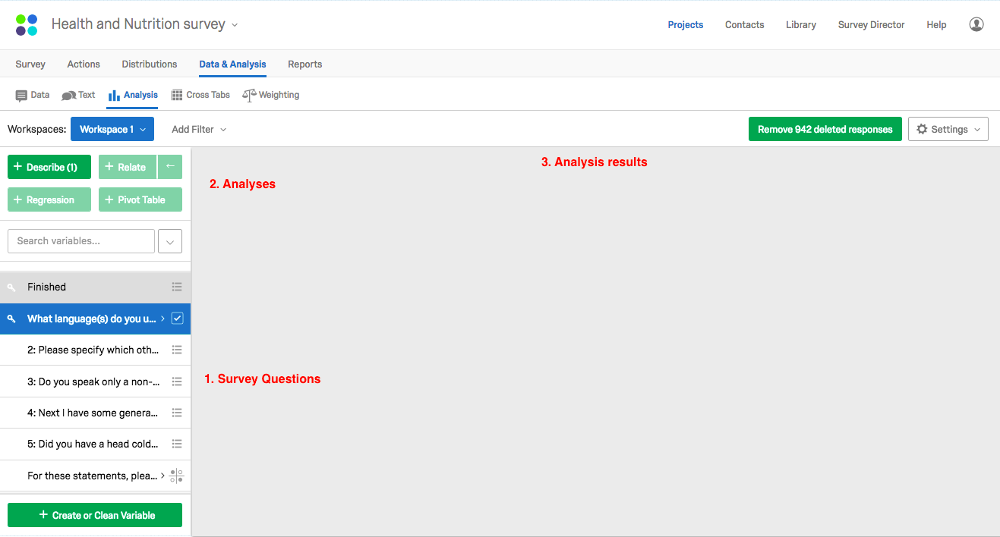
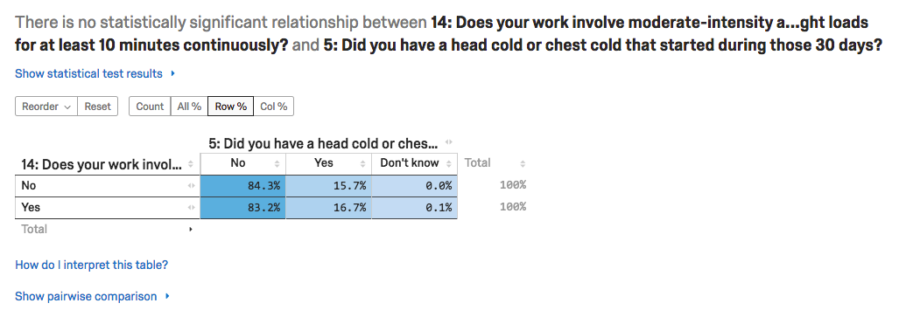

>Objectives
>- Objective 1
>- Objective 2
>- Objective 3
{: .objective}

## Analysis
The analysis platform on Qualtrics is extremely simple to use and has a number of pre-built analyses to run at the press of a button.

Go to the `Analysis` tab (two down from the `Data` tab). There are three parts to this window:
1. the first is the list of our questions at the bottom lefthand corner
2. second there are the pre-built analyses, which are the green buttons at the top lefthand corner
3. is our display window which shows our analysis results.

## Descriptive analysis
First we are going to explore the **Describe** analysis tool which will give us basic statistics expressed in our data.

### Steps
1. Click on `What language(s) do you usually speak...`
2. Then click `+ Describe`. We should see that by far, the survey has collected responses from predominately English speakers.
3. Let's do the same descriptive statistics test for the second question, `Please specify which other languages you speak at home.` That's pretty interesting! Tetum was the predominant "Other language". However, take note of the total sample count (171)! Hardly representative of the total sample population so we can't make any grand claims over our sample group...

**Scenario**: How about we apply a condition to this descriptive statistics test, and find out the answers to the questions, *For all people who speak English (Qn 1), how many also spoke another language?* and *What were the dominant second languages of English speakers?*

### Steps
1. Top righthand corner, we will see a button called `Filters`, click on this.
2. Click on `+ Add Condition Group`
3. Click `Select Variable`
4. Find Qn 1 in the dropdown
5. For `Select Value`, have it be `English`.
So the condition should read: `1_1: What languages(s) d...` `equals` `English`

Observe the results here. Afrikans has moved up a few spots...

## Relationships and Cross Tabulations
We can also run tests against the responses to two tests. Qualtrics calls this **cross tabulation** because the tool produces the results in a table of data.

**Scenario**: What is the correlation between respondents getting sick and work activities that involve physical exercise? We could use Qn 5 and Qn 14 to test this.

### Steps
1. Select ` 5: Have you had a head cold or chest cold that started during the last 30 days?` and `14: Does your work involve moderate-intensity activity that causes small increases in breathing or heart rate such as brisk walking or carrying light loads for at least 10 minutes continuously?`
2. Click on `+ Relate`

A few tips on how to interpret this result...
1. The greyed-out text at the very top is a computer generated description of the analysis result, that there was no [statistical significance](https://en.wikipedia.org/wiki/Statistical_significance) for this test of the entire sample population. If you want to see the statistical significance of this test, click on `Show statistical test results`. The P-Value is the measure of significance or confidence, statistically speaking. What is statistically significant is set to 95% by default. We can change the confidence level by going to `Settings` in the top righthand corner, and clicking `Statistical settings...`
2. On the toggle options below, by default `Col %` is selected. You also have options of `Row %`, `All %` and `Count`. The difference between `Col %` and `Row %` is to do with the direction of the relationship in our cross tabulation. `Col %` is testing for the proportion of Qn 5 responses *within* the Qn 14 responses (e.g., *What proportion of those who have had a cold in the last month have work that involves physical exercise?*).  Alternatively, `Row %` is getting the proportion of Qn 14 in Qn 5 (e.g., *What proportion of those with physical activity at work have had a cold in the last month?*). `All %` and `Count` is much simpler and gives the proportion of responses across the entire sample.

## Exporting Analysis Results
At the top right of each analysis output, you have the option to **export** this analysis in Excel format. This export contains the related aggregate data and the analysis graph of this output.

## Next
> [Go to Module 8]({{ site.baseurl }}/modules/8-where-to-next){: .next-link}
